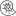

# ammonite 

[]()
[]()
[]()
[]()

Ammonite is a small library made for incremental games.

## Features
- **Small** (under ~3Kb)
- **Immutable** leverages Immutable.js constructs
- **Functional** focuses on pure functions, helps ensure fewer side-effects

## Installation

`npm install ammonite --save`

## API

### `Amount`

Amount is a class that Ammonite uses to control metrics. Its constructor takes a `List` of an item that has the same subset of properties as `Metric` (see [Metric](#Metric) for more information).

| Property       | Type                   |
|----------------|------------------------|
| `load`           | `List<T extends Metric>` |
| `treatAsInteger` | boolean                |

- `load` is the `List`
- `treatAsInteger` will round the value after each evaluation

### `Metric`

Metric is an interface that is F-bounded to `Amount`.

| Property | Type   | Optional? |
|----------|--------|------------|
| `total`    | number | No |
| `time`     | number | Yes |

All generic types of `Amount` must extend from `Metric`. This is easy to do with `extends`.

```Typescript
interface Click extends Metric {
    total: number;
    doubleClick?: boolean;
}
```


## FAQ


Ammonite made by <a href="http://www.freepik.com" title="Freepik">Freepik</a> from <a href="http://www.flaticon.com" title="Flaticon">www.flaticon.com</a> is licensed by <a href="http://creativecommons.org/licenses/by/3.0/" title="Creative Commons BY 3.0" target="_blank">CC 3.0 BY</a>
